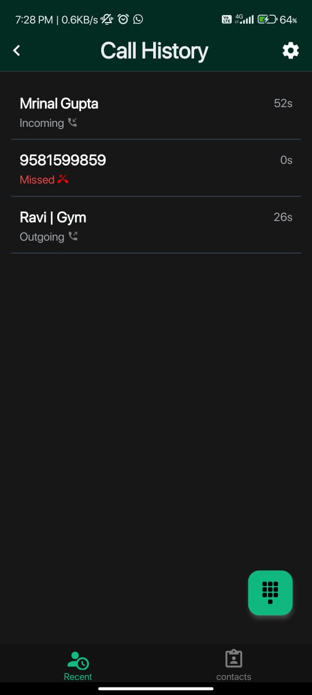
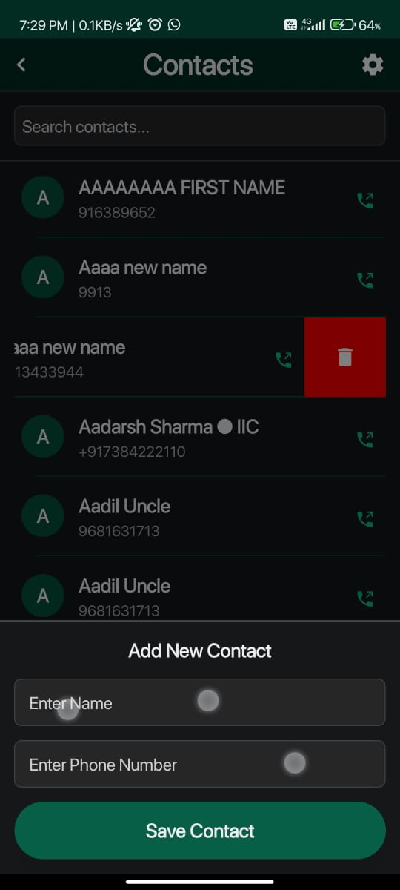
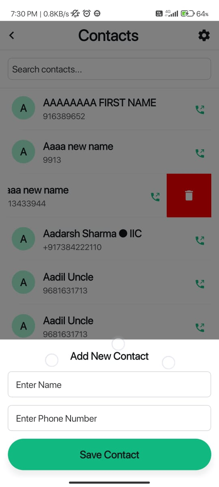

# DialGo

**A modern and intuitive phone dialer app built with React Native, enabling seamless calling, call history management, and contact storage.**

---
## Screenshots

<div style="display: flex; justify-content: center; gap: 10px; flex-wrap: wrap; border-radius:10px;">

  
  
  
  
  
  

</div>

## Features

### 1. Dial Pad
- Traditional phone dial pad with a modern and intuitive design.
- Input numbers and initiate calls effortlessly.
- Save dialed numbers directly to contacts.
- Send messages to dialed numbers instantly.

### 2. Call History
- View and manage recent calls (incoming, outgoing, and missed).
- Fetch call logs with device permissions.
- Instantly update call logs after each call.

### 3. Contacts Management
- Save new contacts and list stored contacts efficiently.
- **Fast Search**: Optimized linear search for a fixed and limited contact list.
- **Delete Contacts**: Easily remove saved contacts with a simple action.

### 4. UI/UX Enhancements
- **Dark & Light Mode**: Seamless theme switching for better accessibility.
- **Optimized Performance**: Efficient state management with Redux for a smooth and responsive experience.
- **Minimal & Clean Interface**: Intuitive design for effortless navigation.

### 5. Interactive Features
- **Interactive Modals**: User-friendly modals for confirmations and alerts.
- **Message with Number**: Send messages directly from the app.
- **Haptic Feedback**: Subtle vibrations on key actions and errors.
- **Toast Notifications**: Informative toast messages for instant feedback.
- **Gesture Controls**: Swipe-to-delete functionality for a smooth user experience.

### 6. Error Handling & Debugging
- **Comprehensive Toast Messages**: Instant notifications for errors and actions.
- **Robust Permission Handling**: Gracefully manage device permissions.
- **User-Friendly Error Messages**: Clear and concise messages to improve usability.


## Tech Stack

- **Frontend:** React Native with Expo (with --dev build)
- **State Management:** Redux Toolkit
- **Call State Management:** React Native Call Detection
- **UI Components:** NativeWind

---

## Setup Instructions

### Prerequisites
- Node.js (v14 or higher)
- Android Studio (for Android emulator)
- Xcode (for iOS simulation, macOS only)
- Expo CLI (`npm install -g expo-cli`)

### Installation

1. Clone the repository:
   ```bash
   git clone https://github.com/your-username/dialgo.git
   ```

2. Navigate to the project directory:
   ```bash
   cd dialgo
   ```

3. Install dependencies:
   ```bash
   npm install
   ```

4. Start the project:
   ```bash
   npx expo start
   ```

5. Run the app on a device or emulator:
   - Press `a` to open the Android emulator.
   - Press `i` to open the iOS simulator (macOS only).

---

## Permissions Required

Ensure the following permissions are granted in `app.json` or `AndroidManifest.xml`:

- **Android:**
  ```xml
  <uses-permission android:name="android.permission.CALL_PHONE" />
  <uses-permission android:name="android.permission.READ_CALL_LOG" />
  <uses-permission android:name="android.permission.WRITE_CONTACTS" />
  ```

- **iOS:**
  Add the following keys to `Info.plist`:
  ```xml
  <key>NSContactsUsageDescription</key>
  <string>We need access to your contacts to manage saved contacts.</string>
  <key>NSCallUsageDescription</key>
  <string>We need access to your call logs to display call history.</string>
  ```

---

## Usage

1. Open the app and grant necessary permissions.
2. Navigate through the following features:
   - **Dial Pad:** Enter a phone number and press the call button.
   - **Call History:** View and manage recent calls.
   - **Contacts:** Add and search for contacts.

---

<!-- ## Project Structure

```
.
├── App.js
├── components
│   ├── DialPad.js
│   ├── CallHistory.js
│   ├── Contacts.js
├── screens
├── redux
│   ├── store.js
│   └── slices
├── assets
└── README.md
``` -->

---

## Contribution Guidelines

1. Fork the repository.
2. Create a new branch for your feature (`git checkout -b feature-name`).
3. Commit your changes (`git commit -m 'Add new feature'`).
4. Push to the branch (`git push origin feature-name`).
5. Create a pull request.

---

## License

This project is licensed under the MIT License. See `LICENSE` for more information.

---

## Contact

For questions or feedback, please contact [theashhar.work@gmail.com].

